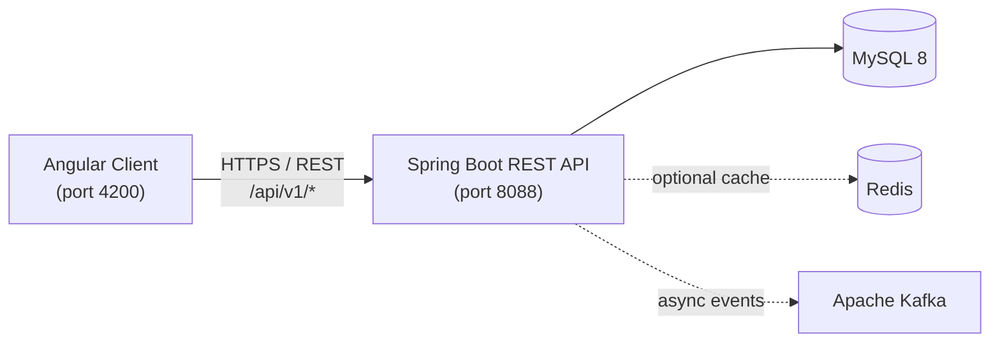

# ShopApp — E-Commerce Platform (Spring Boot + Angular)

[](https://openjdk.org/)
[](https://spring.io/projects/spring-boot)
[](https://angular.dev/)
[](https://www.mysql.com/)
[](https://redis.io/)
[](https://kafka.apache.org/)
[](#)

> Full-stack e-commerce application with a **production-oriented Spring Boot backend** and an **Angular 17** client.  
> Built to demonstrate secure REST API design, relational data modeling, and enterprise backend practices.

**Repository:** [github.com/TuMinhHung0778/E-commerce-Store-with-Spring-Boot-and-Angular](https://github.com/TuMinhHung0778/E-commerce-Store-with-Spring-Boot-and-Angular)

---

## Table of Contents

- [Overview](#overview)
- [Business Domain](#business-domain)
- [Architecture](#architecture)
- [Backend Highlights](#backend-highlights)
- [API Modules](#api-modules)
- [Tech Stack](#tech-stack)
- [Project Structure](#project-structure)
- [Getting Started](#getting-started)
- [Configuration](#configuration)
- [API Documentation](#api-documentation)
- [Docker & Deployment](#docker--deployment)
- [Testing](#testing)
- [Author](#author)

---

## Overview

ShopApp is a modular e-commerce platform that covers the core flows of an online store: user authentication, product catalog, shopping cart / order placement, coupons, and community features (comments & ratings).

The backend is the primary focus of this repository. It follows a **layered architecture** (Controller → Service → Repository) with clear separation between persistence models, DTOs, and API response objects.

| Layer | Responsibility |
|-------|----------------|
| **Controllers** | HTTP routing, input validation, authorization |
| **Services** | Business logic, transactions, caching |
| **Repositories** | Data access via Spring Data JPA |
| **DTOs / Responses** | Stable API contracts decoupled from entities |

---

## Business Domain

This project models a real e-commerce domain with enough complexity to discuss both **business context** and **technical implementation**:

- **Catalog management** — categories, products, multi-image uploads, keyword & category filtering with pagination
- **Order lifecycle** — order creation, status tracking (`PENDING`, `PROCESSING`, `SHIPPED`, `DELIVERED`), order details
- **Customer accounts** — registration, login, profile updates, account blocking (admin)
- **Promotions** — coupon validation and discount calculation
- **Engagement** — product comments and ratings with user verification
- **Administration** — role-based access for catalog and user management

---

## Architecture



**Design decisions:**

- **Stateless security** — JWT access tokens with refresh-token rotation stored in MySQL
- **Schema versioning** — Flyway migrations instead of `ddl-auto: create-drop` in production-like setups
- **API-first** — OpenAPI/Swagger for discoverable, documented endpoints
- **Observability** — Spring Actuator health endpoints for runtime checks
- **Internationalization** — localized error messages (`en` / `vi`) via Spring MessageSource

---

## Backend Highlights

### Security & Authentication
- JWT-based authentication with custom `JwtTokenFilter`
- Refresh token flow (`/api/v1/users/refreshToken`)
- BCrypt password hashing
- Role-based access control (`ROLE_USER`, `ROLE_ADMIN`) via `@PreAuthorize`
- OAuth2 client integration (Facebook) with `CustomOAuth2UserService`
- CORS configuration for frontend integration

### Data & Persistence
- Spring Data JPA / Hibernate ORM with MySQL 8
- Flyway migrations (`V1`–`V5`) for tokens, comments, and coupons
- JPA Specifications for dynamic product search (keyword, category, price range)
- DTO + ModelMapper pattern to keep entities internal

### Performance & Scalability Concepts
- Redis-backed product listing cache (toggle via `spring.data.redis.use-redis-cache`)
- Kafka producer configuration for asynchronous order/notification workflows
- Paginated list endpoints across users, products, and orders

### API Quality
- Jakarta Bean Validation on request DTOs
- Structured custom exceptions (`DataNotFoundException`, `PermissionDenyException`, etc.)
- Swagger UI + OpenAPI 3 spec generation
- Postman collection available under `DocumentShopApp/postman/`

---

## API Modules

All endpoints are prefixed with **`/api/v1`**.

| Module | Base Path | Key Operations |
|--------|-----------|----------------|
| Users | `/users` | Register, login, refresh token, profile CRUD, block user |
| Roles | `/roles` | List roles |
| Categories | `/categories` | CRUD |
| Products | `/products` | CRUD, search/filter, image upload & serving |
| Orders | `/orders` | Create, list by user, update status, keyword search |
| Order Details | `/order_details` | CRUD per line item |
| Coupons | `/coupons` | Discount calculation |
| Comments | `/comments` | List, create, update ratings |
| Health | `/healthcheck` | Application health probe |

**Default ports:**
- Backend API: `http://localhost:8088`
- Swagger UI: `http://localhost:8088/swagger-ui/index.html`
- Actuator: `http://localhost:8088/api/v1/actuator/health`

---

## Tech Stack

### Backend
| Category | Technology |
|----------|------------|
| Language | Java 17 (LTS) |
| Framework | Spring Boot 3.1.2 |
| Security | Spring Security, JWT (jjwt 0.11.5), OAuth2 Client |
| Persistence | Spring Data JPA, Hibernate, MySQL Connector/J |
| Migration | Flyway 10.x |
| Cache | Spring Data Redis, Lettuce |
| Messaging | Spring Kafka |
| Mapping | ModelMapper |
| Documentation | SpringDoc OpenAPI 3 |
| Build | Maven (wrapper included) |
| Utilities | Lombok, JavaFaker (seed data) |

### Frontend
| Category | Technology |
|----------|------------|
| Framework | Angular 17 |
| Language | TypeScript 5.2 |
| UI | Bootstrap 5, ng-bootstrap |
| Auth | @auth0/angular-jwt |
| SSR | Angular Universal (@angular/ssr) |

### DevOps & Tooling
| Category | Technology |
|----------|------------|
| Containerization | Docker (multi-stage builds) |
| Orchestration samples | Kubernetes manifests in `DocumentShopApp/` |
| API Testing | Postman collection |
| Logging | SLF4J + Logback |

---

## Project Structure

```
Java-Springboot-And-Angular/
├── shopapp-backend/          # Main Spring Boot application (run this)
│   ├── src/main/java/com/project/shopapp/
│   │   ├── configurations/   # Security, Redis, Kafka, WebMvc
│   │   ├── controllers/      # REST endpoints
│   │   ├── services/         # Business logic
│   │   ├── repositories/     # JPA repositories
│   │   ├── models/           # JPA entities
│   │   ├── dtos/             # Request payloads
│   │   ├── responses/        # API response objects
│   │   ├── filters/          # JWT filter
│   │   └── exceptions/       # Domain exceptions
│   └── src/main/resources/
│       ├── application.yml
│       └── dev/db/migration/ # Flyway SQL scripts
│
├── shopapp-angular/          # Angular 17 SPA + SSR
│
├── DocumentShopApp/          # Course materials & DevOps artifacts
│   ├── sql/                  # Database seed scripts
│   ├── postman/              # API collection
│   ├── DockerfileJavaSpring
│   ├── DockerfileAngular
│   ├── deployment.yaml
│   └── kafka-deployment.yaml
│
└── README.md
```

> **Note:** `DocumentShopApp/` contains incremental learning snapshots, SQL scripts, Docker/Kubernetes configs, and Postman collections. The runnable application lives in `shopapp-backend/` and `shopapp-angular/` at the repository root.

---

## Getting Started

### Prerequisites

| Tool | Version |
|------|---------|
| JDK | 17+ |
| Maven | 3.8+ (or use `./mvnw`) |
| MySQL | 8.0+ |
| Node.js | 18 LTS+ (frontend only) |
| Redis | 6+ (optional, for caching) |
| Kafka | 3.x (optional, for event publishing) |

### 1. Clone the repository

```bash
git clone https://github.com/TuMinhHung0778/E-commerce-Store-with-Spring-Boot-and-Angular.git
cd E-commerce-Store-with-Spring-Boot-and-Angular
```

### 2. Prepare the database

Create a MySQL database named `ShopApp`, then optionally import the seed script:

```bash
mysql -u root -p < DocumentShopApp/sql/database.sql
```

Flyway will apply incremental migrations on startup.

### 3. Configure environment

Update `shopapp-backend/src/main/resources/application.yml` or set environment variables:

```bash
export SPRING_DATASOURCE_URL="jdbc:mysql://localhost:3306/ShopApp?useSSL=false&serverTimezone=UTC&allowPublicKeyRetrieval=true"
export MYSQL_ROOT_PASSWORD="your_password"
export REDIS_HOST="localhost"
export REDIS_PORT="6379"
```

### 4. Run the backend

```bash
cd shopapp-backend
./mvnw spring-boot:run        # Linux / macOS
# mvnw.cmd spring-boot:run    # Windows
```

Verify: open `http://localhost:8088/api/v1/healthcheck/health`

### 5. Run the frontend (optional)

```bash
cd shopapp-angular
npm install
npm start
```

Frontend: `http://localhost:4200`

---

## Configuration

Key settings in `application.yml`:

| Property | Default | Description |
|----------|---------|-------------|
| `server.port` | `8088` | API server port |
| `api.prefix` | `/api/v1` | Global API prefix |
| `spring.jpa.hibernate.ddl-auto` | `none` | Schema managed by Flyway |
| `spring.data.redis.use-redis-cache` | `false` | Enable Redis product cache |
| `jwt.expiration` | `2592000` | Access token TTL (30 days) |
| `jwt.expiration-refresh-token` | `5184000` | Refresh token TTL (60 days) |

> **Security note:** Replace the default `jwt.secretKey` and database credentials before deploying to any shared environment.

---

## API Documentation

| Resource | URL |
|----------|-----|
| Swagger UI | `http://localhost:8088/swagger-ui/index.html` |
| OpenAPI JSON | `http://localhost:8088/api-docs` |
| Postman Collection | `DocumentShopApp/postman/ShopAppJavaSpringUdemy2023.postman_collection.json` |

Protected endpoints require a Bearer token:

```http
Authorization: Bearer <access_token>
```

Obtain a token via `POST /api/v1/users/login`.

---

## Docker & Deployment

Multi-stage Dockerfiles are provided in `DocumentShopApp/`:

```bash
# Build backend image
cd DocumentShopApp
docker build -t shopapp-backend:latest -f DockerfileJavaSpring .

# Run container
docker run -p 8088:8088 \
  -e SPRING_DATASOURCE_URL="jdbc:mysql://host.docker.internal:3306/ShopApp" \
  -e MYSQL_ROOT_PASSWORD="your_password" \
  shopapp-backend:latest
```

Additional Kubernetes manifests (`deployment.yaml`, `kafka-deployment.yaml`) are available for container orchestration experiments.

---

## Testing

```bash
cd shopapp-backend
./mvnw test
```

The project includes Spring Boot test scaffolding. Integration and unit test coverage is an active area for improvement — contributions welcome.

---

## Author

**Tu Minh Hung** — Backend-focused Software Engineer

| | |
|---|---|
| Email | [tuminhhung0901@gmail.com](mailto:tuminhhung0901@gmail.com) |
| GitHub | [github.com/TuMinhHung0778](https://github.com/TuMinhHung0778) |
| LinkedIn | [linkedin.com/in/tu-minh-hung](https://www.linkedin.com/in/t%E1%BB%AB-minh-h%C6%B0ng-85a865260/) |
| Location | Da Nang, Vietnam |

---

If this project is useful to you, consider giving it a star on GitHub.
