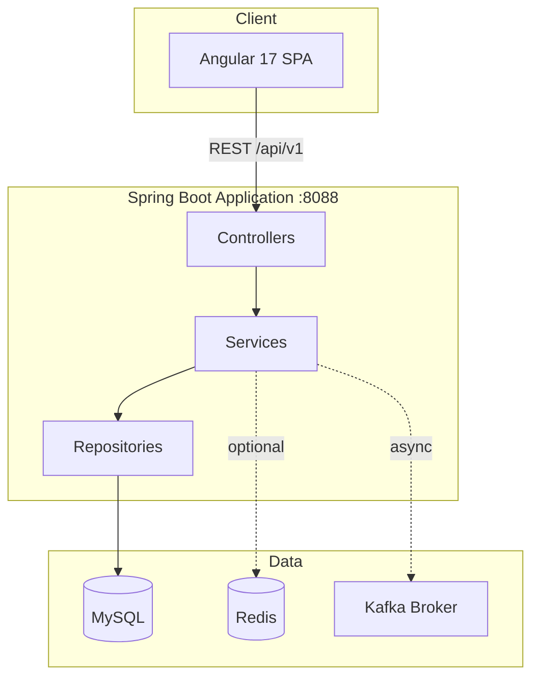
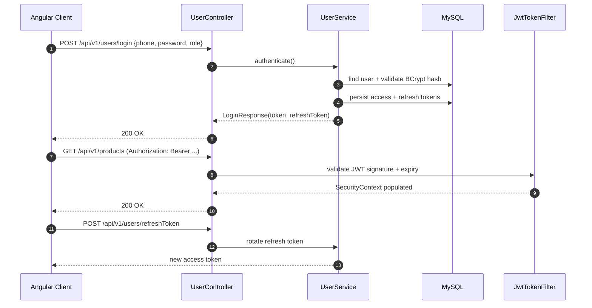
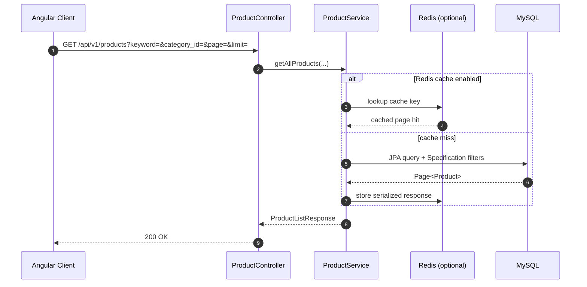
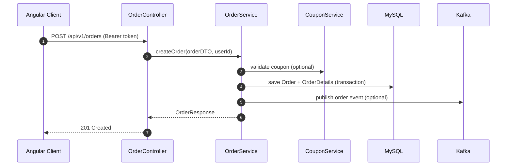

# NovaMart — E-Commerce Platform (Spring Boot + Angular)

[](https://openjdk.org/)
[](https://spring.io/projects/spring-boot)
[](https://angular.dev/)
[](https://www.mysql.com/)
[](https://redis.io/)
[](https://kafka.apache.org/)

> **NovaMart** is a full-stack e-commerce platform I designed and implemented to practice production-style backend engineering: secure REST APIs, relational modeling, schema migrations, API documentation, and optional cache/event integrations.

**Live repo:** [github.com/TuMinhHung0778/E-commerce-Store-with-Spring-Boot-and-Angular](https://github.com/TuMinhHung0778/E-commerce-Store-with-Spring-Boot-and-Angular)

---

## Table of Contents

1. [Project Snapshot](#project-snapshot)
2. [System Architecture](#system-architecture)
3. [UI Preview](#ui-preview)
4. [Core API Flows](#core-api-flows)
5. [Backend Design](#backend-design)
6. [API Reference](#api-reference)
7. [Tech Stack](#tech-stack)
8. [Repository Layout](#repository-layout)
9. [Getting Started](#getting-started)
10. [Configuration](#configuration)
11. [Docker Deployment](#docker-deployment)
12. [Testing & Quality](#testing--quality)
13. [Author](#author)

---

## Project Snapshot

| Item | Detail |
|------|--------|
| **Product name** | NovaMart |
| **Domain** | B2C e-commerce |
| **My role** | Backend developer (full-stack integration) |
| **Backend** | Java 17, Spring Boot 3.1.2, Spring Security, JPA/Hibernate |
| **Frontend** | Angular 17, Bootstrap 5, JWT interceptor |
| **Database** | MySQL 8 + Flyway migrations |
| **Docs** | OpenAPI 3 / Swagger UI, Postman collection |
| **Extras** | Redis cache toggle, Kafka producer, Docker/K8s samples |

**Business capabilities**

- Product catalog with search, category filter, pagination, and image upload
- User registration/login with JWT + refresh tokens and RBAC
- Order creation with shipping details, coupon calculation, and status tracking
- Product comments/ratings and admin management endpoints
- Health checks via Spring Actuator

---

## System Architecture




**Architectural principles I applied**

- **Layered monolith** — clear boundaries without premature microservice complexity
- **DTO boundary** — entities never leak directly to API consumers
- **Security by default** — authenticated routes enforced through Spring Security + `@PreAuthorize`
- **Versioned schema** — Flyway instead of destructive `ddl-auto` in shared environments
- **Observable API** — Swagger for contract discovery and Actuator for health probes

---

## UI Preview

The storefront uses a custom teal/slate design system (not a default template skin).


| Screen | Route | Purpose |
|--------|-------|---------|
| Home / catalog | `/` | Search, filter, paginate products |
| Product detail | `/products/:id` | Gallery, price, add to cart |
| Checkout | `/orders` | Shipping form, coupon, place order |
| Auth | `/login`, `/register` | JWT login with role selection |
| Admin | `/admin/*` | Product & order management |

---

## Core API Flows

### 1) Authentication & token refresh



**Endpoints involved**

| Step | Method | Path |
|------|--------|------|
| Register | `POST` | `/api/v1/users/register` |
| Login | `POST` | `/api/v1/users/login` |
| Refresh | `POST` | `/api/v1/users/refreshToken` |
| Profile | `POST` | `/api/v1/users/details` |

---

### 2) Product discovery & caching



**Query parameters**

| Param | Type | Description |
|-------|------|-------------|
| `keyword` | string | Name/description search |
| `category_id` | long | Filter by category (`0` = all) |
| `page` | int | Zero-based page index |
| `limit` | int | Page size |

---

### 3) Order placement



**Order statuses:** `PENDING` → `PROCESSING` → `SHIPPED` → `DELIVERED`

---

## Backend Design

### Package structure

```
com.project.shopapp
├── configurations/     # Security, Redis, Kafka, WebMvc, ModelMapper
├── controllers/        # REST adapters
├── services/           # Business logic (+ interfaces)
├── repositories/       # Spring Data JPA
├── models/             # JPA entities
├── dtos/               # Request payloads
├── responses/          # Response payloads
├── filters/            # JwtTokenFilter
├── exceptions/         # Domain-specific errors
└── components/         # LocalizationUtils, etc.
```

### Security model

| Route pattern | Access |
|---------------|--------|
| `/users/register`, `/users/login`, `/users/refreshToken` | Public |
| `GET /categories/**`, `GET /products/**` | Public |
| `POST /products`, `PUT /products/**`, `DELETE /**` | `ROLE_ADMIN` |
| `/orders/**`, `/users/details/**` | Authenticated user |

### Database migrations (Flyway)

| Version | Script | Purpose |
|---------|--------|---------|
| V1 | `V1__alter_some_tables.sql` | Baseline schema adjustments |
| V2 | `V2__change_tokens.sql` | Token table updates |
| V3 | `V3__refresh_tokens.sql` | Refresh token support |
| V4 | `V4__create_comments_table.sql` | Product comments |
| V5 | `V5__create_coupon_table.sql` | Coupon engine |

---

## API Reference

Base URL: `http://localhost:8088/api/v1`

| Module | Endpoint | Methods | Notes |
|--------|----------|---------|-------|
| Health | `/healthcheck/health` | GET | Public probe |
| Users | `/users` | GET | Admin list |
| Users | `/users/register` | POST | Public |
| Users | `/users/login` | POST | Returns JWT |
| Users | `/users/refreshToken` | POST | Token rotation |
| Categories | `/categories` | GET, POST, PUT, DELETE | GET public |
| Products | `/products` | GET, POST, PUT, DELETE | Search + CRUD |
| Products | `/products/uploads/{id}` | POST | Multipart images |
| Orders | `/orders` | GET, POST, PUT, DELETE | User-scoped |
| Order details | `/order_details` | CRUD | Line items |
| Coupons | `/coupons/calculate` | GET | Discount preview |
| Comments | `/comments` | GET, POST, PUT | Ratings |

**Interactive docs**

| Resource | URL |
|----------|-----|
| Swagger UI | http://localhost:8088/swagger-ui/index.html |
| OpenAPI JSON | http://localhost:8088/api-docs |
| Postman | `DocumentShopApp/postman/NovaMart-API.postman_collection.json` |

---

## Tech Stack

### Backend
Java 17 · Spring Boot 3.1.2 · Spring Security · Spring Data JPA · Hibernate · MySQL · Flyway · Redis · Kafka · ModelMapper · Lombok · SpringDoc OpenAPI · Actuator · Maven

### Frontend
Angular 17 · TypeScript · RxJS · Bootstrap 5 · ng-bootstrap · Angular JWT · SSR ready

### DevOps
Docker multi-stage builds · Kubernetes sample manifests · Postman · Logback

---

## Repository Layout

```
.
├── shopapp-backend/       # Runnable Spring Boot API
├── shopapp-angular/       # Runnable Angular storefront
├── DocumentShopApp/       # SQL seeds, Postman, Docker/K8s, learning snapshots
├── docs/images/           # Architecture & UI diagrams for README
└── README.md
```

---

## Getting Started

### Prerequisites

JDK 17+, Maven 3.8+, MySQL 8+, Node.js 18+ (frontend), Redis/Kafka optional

### Backend

```bash
git clone https://github.com/TuMinhHung0778/E-commerce-Store-with-Spring-Boot-and-Angular.git
cd E-commerce-Store-with-Spring-Boot-and-Angular/shopapp-backend

# Create database
mysql -u root -p -e "CREATE DATABASE IF NOT EXISTS ShopApp;"

# Optional seed data
mysql -u root -p ShopApp < ../DocumentShopApp/sql/database.sql

./mvnw spring-boot:run
```

Verify:

```bash
curl http://localhost:8088/api/v1/healthcheck/health
```

### Frontend

```bash
cd ../shopapp-angular
npm install
npm start
```

Open http://localhost:4200

---

## Configuration

`shopapp-backend/src/main/resources/application.yml`

| Key | Default | Description |
|-----|---------|-------------|
| `server.port` | `8088` | API port |
| `api.prefix` | `/api/v1` | Route prefix |
| `spring.jpa.hibernate.ddl-auto` | `none` | Flyway owns schema |
| `spring.data.redis.use-redis-cache` | `false` | Toggle Redis cache |
| `jwt.expiration` | 30 days | Access token TTL |
| `jwt.expiration-refresh-token` | 60 days | Refresh token TTL |

Environment overrides:

```bash
export SPRING_DATASOURCE_URL="jdbc:mysql://localhost:3306/ShopApp?useSSL=false&serverTimezone=UTC"
export MYSQL_ROOT_PASSWORD="your_password"
export REDIS_HOST="localhost"
```

> Replace default JWT secret before any shared deployment.

---

## Docker Deployment

```bash
cd DocumentShopApp
docker build -t novamart-api:latest -f DockerfileJavaSpring .
docker run -p 8088:8088 \
  -e SPRING_DATASOURCE_URL="jdbc:mysql://host.docker.internal:3306/ShopApp" \
  -e MYSQL_ROOT_PASSWORD="your_password" \
  novamart-api:latest
```

See also `deployment.yaml` and `kafka-deployment.yaml` for Kubernetes experiments.

---

## Testing & Quality

```bash
cd shopapp-backend
./mvnw test
```

Current coverage includes Spring Boot context tests. Planned improvements: service-layer unit tests and `@WebMvcTest` controller tests for auth and order flows.

---

## Author

**Tu Minh Hung** — Software Engineer (Java / JavaScript)

| | |
|---|---|
| Email | [tuminhhung0901@gmail.com](mailto:tuminhhung0901@gmail.com) |
| GitHub | [github.com/TuMinhHung0778](https://github.com/TuMinhHung0778) |
| LinkedIn | [linkedin.com/in/tu-minh-hung](https://www.linkedin.com/in/t%E1%BB%AB-minh-h%C6%B0ng-85a865260/) |
| Portfolio | See `/portfolio` in workspace |
| Location | Da Nang, Vietnam |

---

Built with Spring Boot and Angular. Contributions and feedback welcome.
