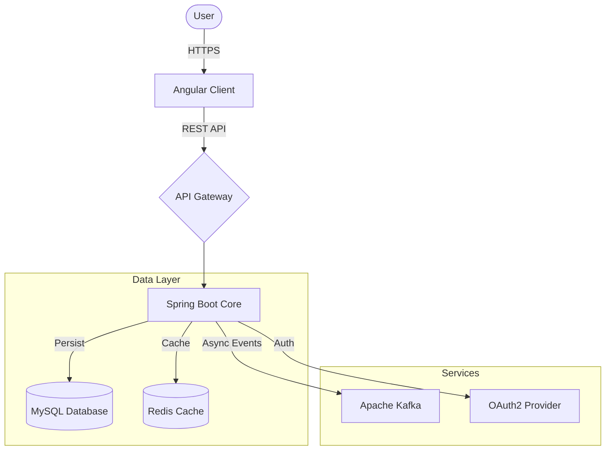

# 🛍️ ShopApp - Enterprise Level E-Commerce Platform


> **A robust, full-stack E-commerce solution built with modern microservices-ready architecture.**
> *Designed for scalability, security, and high performance.*

---

## 📖 Introduction

**ShopApp** is not just another e-commerce website; it is a full-featured platform engineered to demonstrate high-end software development practices. It bridges a powerful **Java Spring Boot** backend with a dynamic **Angular** frontend, ensuring a seamless user experience while maintaining rigorous data integrity and security standards.

This project showcases advanced backend concepts such as **Event-Driven Architecture (Kafka)**, **In-Memory Caching (Redis)**, and **Stateless Security (JWT & OAuth2)**, making it a production-grade codebase.

## 🏗️ System Architecture

The system follows a layered architecture, enforcing separation of concerns and modularity.



## ⭐ Key Technical Features

### 🔐 Advanced Security & Identity Management
*   **Stateless Authentication**: Implemented pure **JWT (JSON Web Token)** based authentication filters.
*   **Role-Based Access Control (RBAC)**: Fine-grained permissions for `USER` and `ADMIN` roles at the endpoint level.
*   **OAuth2 Integration**: Supports social login features (Google/Facebook) via standard OAuth2 Client flows.
*   **Security Best Practices**: Password hashing with BCrypt, CORS configuration, and XSS protection.

### 🚀 Performance & Scalability
*   **Redis Caching**: Implements caching strategies for product listings and categories to reduce database load and improve response times (millisecond latency).
*   **Apache Kafka Integration**: Designed for asynchronous order processing and notifications, ensuring the user interface remains responsive even during heavy background tasks.
*   **Database Migrations**: Uses **Flyway** for version-controlled database schema changes, ensuring consistency across development and production environments.

### 🛒 Comprehensive E-Commerce Logic
*   **Smart Product Filtering**: Dynamic query specifications to filter products by price, category, and keywords.
*   **DTO Pattern**: usage of Data Transfer Objects and `ModelMapper` to decouple internal database entities from API contracts.
*   **Order Lifecycle**: Complex state management for Orders (Pending, Processing, Shipped, Delivered).
*   **Interactive Community**: Comment and Rating system with user verification.

## 🛠️ Tech Stack Details

### Backend (Spring Boot)
| Component | Technology | Description |
|-----------|------------|-------------|
| **Core Framework** | Spring Boot 3.1.2| The backbone of the application |
| **Language** | Java 17 | LTS version for varied modern features |
| **ORM** | Spring Data JPA (Hibernate) | Efficient database abstraction |
| **Database** | MySQL | Reliable relational data storage |
| **Migration** | Flyway | Database schema version control |
| **Caching** | Redis | In-memory data store for high-speed access |
| **Messaging** | Apache Kafka | Event streaming platform |
| **API Docs** | OpenApi / Swagger | Auto-generated interactive API documentation |

### Frontend (Angular)
| Component | Technology | Description |
|-----------|------------|-------------|
| **Framework** | Angular 17 | Modern, signal-based reactive framework |
| **Language** | TypeScript | Strongly typed JavaScript super-set |
| **Styling** | Bootstrap 5 / SCSS | Responsive and modular UI design |
| **SSR** | Angular Universal | Server-Side Rendering for SEO and performance |
| **State** | RxJS | Reactive interaction handling |

## � Installation & Setup Guide

### Prerequisites
*   [Java JDK 17](https://www.oracle.com/java/technologies/downloads/#java17)
*   [Node.js](https://nodejs.org/) (LTS Version)
*   [MySQL](https://www.mysql.com/)
*   [Redis](https://redis.io/) (Run via Docker recommended)

### 1️⃣ Backend Setup
```bash
# Clone the repository
git clone https://github.com/TuMinhHung0778/E-commerce-Store-with-Spring-Boot-and-Angular.git

# Navigate to backend
cd shopapp-backend

# Configure Database
# Edit src/main/resources/application.yml with your MySQL/Redis credentials

# Run with Maven Wrapper
./mvnw spring-boot:run
```
> The API Server will start at `http://localhost:8088`
> Swagger UI documentation available at: `http://localhost:8088/swagger-ui/index.html`

### 2️⃣ Frontend Setup
```bash
# Navigate to frontend
cd shopapp-angular

# Install Dependencies
npm install

# Start Development Server
npm start
```
> Access functionality at `http://localhost:4200`

## � Screenshots
*(I will update and add the screenshots here as soon as possible.)*
| Home Page | Product Detail | Admin Dashboard |
|:---:|:---:|:---:|
|  |  |  |

<!-- 
Tip for the owner: 
Take screenshots of your app and put them in a 'screenshots' folder, then update the paths above!
-->

## 🤝 Contact & Portfolio
*   **Developer**: [Minh Hung]
*   **Email**: [tuminhhung0901@gmail.com]
*   **GitHub**: [https://github.com/TuMinhHung0778](https://github.com/TuMinhHung0778)
*   **LinkedIn**: [https://www.linkedin.com/in/t%E1%BB%AB-minh-h%C6%B0ng-85a865260/](https://www.linkedin.com/in/t%E1%BB%AB-minh-h%C6%B0ng-85a865260/)

---
*If you find this project impressive, please give it a star ⭐ on GitHub!*
